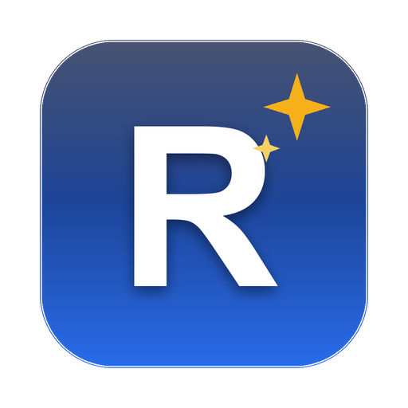

<div align="center">



# OpenRomeo

**Your AI coworker that delivers finished work — on your desktop, with your keys.**

[](https://github.com/romizone/OpenRomeo/releases)
[](https://github.com/romizone/OpenRomeo/actions/workflows/ci.yml)
[](LICENSE)
[](#-download)

*A supercharged fork of [OpenWorker](https://github.com/andrewyng/openworker) — latest frontier
models, builtin document skills, image generation, and a fresh identity.*

</div>

---

## ✨ Highlights

- **Finished work, not just chat** — polished documents, updated calendars, Slack replies with
  the numbers, a triaged inbox. Deliverables land as real files.
- **Latest frontier models** — GPT‑5.6 · Claude Fable 5 / Sonnet 5 · Gemini 3.6 · Kimi K3 ·
  MiniMax M3 · DeepSeek V4 · GLM‑5.2 · Grok 4.5 — vision enabled on the multimodal flagships,
  or run fully local with Ollama.
- **Builtin document skills** — the Claude Desktop-standard suite: `docx` (Word), `pptx`
  (PowerPoint), `xlsx` (Excel), and `pdf`, in the Anthropic SKILL.md format; your own
  skills override them by name.
- **Image generation** — a `generate_image` tool renders PNGs into your workspace via
  OpenAI `gpt-image-2` or Gemini Nano Banana 2, using the provider key you already configured.
- **25+ integrations** — GitHub, Slack, Jira, Notion, Gmail, Google Calendar, HubSpot, Outlook,
  and anything reachable over [MCP](https://modelcontextprotocol.io/) — plus your terminal
  and local files.
- **Approval‑gated by design** — writes, sends, shell commands, and paid API calls ask first;
  unattended runs park their asks in an inbox instead of acting alone.
- **Local‑first privacy** — conversations, tokens, and keys stay on your machine. The only
  optional cloud piece brokers OAuth handshakes.

## 📦 Download

| Platform | Installer | Notes |
|---|---|---|
| macOS · Apple Silicon | [`OpenRomeo-macos-arm64.dmg`](https://github.com/romizone/OpenRomeo/releases/latest/download/OpenRomeo-macos-arm64.dmg) | macOS 12+ |
| macOS · Intel | [`OpenRomeo-macos-intel.dmg`](https://github.com/romizone/OpenRomeo/releases/latest/download/OpenRomeo-macos-intel.dmg) | macOS 12+ |
| Windows 10/11 · x64 | [`OpenRomeo-windows-setup.exe`](https://github.com/romizone/OpenRomeo/releases/latest/download/OpenRomeo-windows-setup.exe) | NSIS installer |
| Windows 10/11 · x64 (MSI) | [`OpenRomeo-windows.msi`](https://github.com/romizone/OpenRomeo/releases/latest/download/OpenRomeo-windows.msi) | For managed installs |

> **Unsigned builds:** on macOS, first launch needs **right‑click → Open**; on Windows,
> SmartScreen shows a warning — choose **More info → Run anyway**.

Open the app, add a model key (or point it at Ollama), and ask for something real.

## 🔐 First run — no account needed

OpenRomeo has **no sign-up, no login, and no subscription**. Authentication works like this:

1. **The app itself** — none. Download, open, pick a working folder.
2. **Your model key (the only requirement)** — paste your own API key for OpenAI,
   Anthropic, Google, MiniMax, Kimi, or any supported provider (the **Test** button
   verifies it with one read-only call), **or** point at a local
   [Ollama](https://ollama.com) and skip keys entirely. Model usage bills to *your*
   provider account.
3. **Integrations (optional)** — two paths per connector:
   - **Manual token paste** — fully local, available for almost every integration
     (monday.com uses a local in-app OAuth flow instead — still no cloud sign-in).
   - **One-click OAuth** — an optional sign-in to the upstream *OpenWorker Cloud*
     broker that handles OAuth consent for you. Long-lived tokens are written only to
     your machine, though they do pass through the broker during consent and refresh
     (GitHub instead uses short-lived, cloud-minted tokens). Skipping the broker
     entirely is fully supported.
4. **Where credentials live** — locally, in the app's secret store
   (`~/.config/coworker/` on macOS/Linux, `%APPDATA%\coworker` on Windows). Your
   conversations and keys never go to an OpenRomeo server — there isn't one. (If you
   sign in to the broker, it keeps connection metadata and opt-out session telemetry.)

## 🧩 Skills

Skills teach the agent repeatable workflows using the
[Anthropic Agent Skills](https://github.com/anthropics/skills) `SKILL.md` format —
skills written for Claude Desktop / Claude Code drop straight in.

**Builtin** (ship with the app): `docx`, `pptx`, `xlsx`, `pdf` — the standard document
suite. Only each skill's name + description sits in context; full instructions load
on demand.

**Add a skill** — create a folder with a `SKILL.md`:

```
~/.config/coworker/skills/<name>/SKILL.md        # every session (user-wide)
<your-project>/.coworker/skills/<name>/SKILL.md  # one workspace only
```

```markdown
---
name: release-notes
description: Draft release notes from merged PRs. Use when the user asks for a changelog.
---
Step-by-step instructions the agent follows when the skill is loaded…
```

**Override a builtin** — use the same name (`docx`, `xlsx`, …) in your user or
workspace folder; it wins over the builtin. **Remove a skill** — delete its folder.
New sessions pick up changes immediately; no restart needed.

## 🚀 Quick start (from source)

Prerequisites: Python 3.10+, Node 20+, and the Rust toolchain via [rustup](https://rustup.rs/).

```bash
git clone https://github.com/romizone/OpenRomeo
cd OpenRomeo
bash packaging/setup_dev_env.sh                    # one-time: creates .venv

.venv/bin/openworker-server --cwd ~/some/project --port 8765   # terminal 1

cd surfaces/gui && npm install && npm run dev                  # terminal 2 → browser UI
```

For the full desktop app, replace the last step with `npm run tauri dev`.
Tests: `.venv/bin/pytest` (backend) · `npm test` + `npm run e2e` in `surfaces/gui` (GUI).

## 🧠 Bring your own model

Model access is yours: pick a provider, paste your key, switch anytime.

| Provider | Curated models |
|---|---|
| OpenAI | GPT‑5.6 Sol / Terra / Luna · GPT‑5.5 |
| Anthropic | Claude Fable 5 · Opus 4.8 · **Sonnet 5** · Haiku 4.5 |
| Google | Gemini 3.6 Flash · 3.1 Pro · 2.5 Pro / Flash |
| Moonshot | **Kimi K3** (2.8T, 1M context, vision) |
| MiniMax | **MiniMax M3** (428B MoE, 1M context, vision) |
| xAI | **Grok 4.5** (vision) |
| DeepSeek · Z.ai · Qwen · Mistral | V4 Pro/Flash · GLM‑5.2 · Qwen3 Max · Mistral Large |
| Together · Fireworks | Open‑weight flagships (Kimi, GLM, DeepSeek, Llama 4) |
| Ollama | Any local model |

Any custom model string works too, with conservative capability fallbacks.

## 🏗 Architecture

```text
┌────────────────────────────────────────────────┐
│             OpenRomeo desktop app              │  Tauri shell + React UI
├────────────────────────────────────────────────┤
│           local agent server (Python)          │  engine · tools · skills · connectors
├───────────────┬────────────────┬───────────────┤
│  your files   │   your tools   │  your model   │  everything runs with your keys,
│  & terminal   │ 25+ connectors │  any provider │  on your machine
└───────────────┴────────────────┴───────────────┘
```

| Directory | What's in it |
|---|---|
| `coworker/` | Python backend — agent engine, providers, connectors, MCP, memory, automations, builtin skills |
| `surfaces/gui/` | Desktop app — React UI + Tauri shell that supervises the server |
| `stt/` | Speech‑to‑text sidecar (Rust, local Whisper) for voice input |
| `packaging/` | Installer builds (macOS DMG incl. Intel cross‑build, Windows), auto‑update manifest |
| `tests/` | Backend test suite (870+ tests) |

## 🙏 Credits & license

OpenRomeo is a personal fork of [**OpenWorker**](https://github.com/andrewyng/openworker) by
Andrew Ng and contributors, which is built on [**aisuite**](https://github.com/andrewyng/aisuite).
Huge thanks to both projects — the agent engine, permission model, and connector platform are
their work.

Licensed under [MIT](LICENSE).
